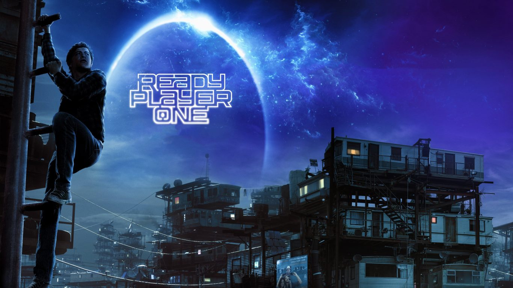

# Flip a vote

I wondered:

In which movie does a teenager win a chance to test a video game by a mystic entrepreneur. In a scene he gets a quarter, forgets he has it in his pocket, but later it turns out to be enough to tip the scales for the better outcome?

ChatGPT: The movie you're referring to is *Ready Player One* (2018), directed by Steven Spielberg. In this film, the protagonist, Wade Watts (Parzival), participates in a high-stakes virtual reality contest created by the late James Halliday, the enigmatic founder of the OASIS. During his quest, Wade earns a quarter by achieving a perfect score in the classic arcade game Pac-Man. Initially, this quarter seems insignificant, but it later proves crucial by granting him an extra life, allowing him to overcome a critical challenge and ultimately succeed in the contest.

This repository was created on election day November 5, the same day I registered flipavote.com. Can a nice "I flipped my vote" functionality be set up in 4 hours?